# Can we predict the smog only on the basis of the weather forecast?

## Table of context

* [Introduction](#introduction)  
* [The progress of the analysis](#the-progress-of-the-analysis)  
* [Data sources](#data-sources)  
* [Data exploration](#data-exploration)  
  * [PM 10 distribution](#pm-10-distribution)  
  * [Temperature](#temperature)  
  * [Wind speed](#wind-speed)  
  * [Humidity](#humidity)  
  * [Pressure](#pressure)  
  * [Precipitation](#precipitation)  
  * [Feels like temperature](#feels-like-temperature)  
  * [Cloudiness](#cloudiness)  
  * [Wind direction](#wind-direction)  
* [PM10 modelling](#pm10-modelling)  
* [Air pollution modelling](#air-pollution-modelling)  

## Introduction

Smog is a very big problem in Poland. Especially in a winter there are warnings in a mass media almost every day. The air here is one of the worst in Europe. There are mainly two things responsible for this state: transport and coal-heating. A lot of people argue about which of these sources has bigger impact on air pollution, but this is not the subject of this analysis. One the other hand there are some factors that decrease air pollution. For example it is well-known fact that strong wind blows away smog from the city. In this analysis I will try to find some predictors for smog levels. As I have full weather data and no data about traffic or coal-heating, I will make some assumptions. Temperature is probably highly correlated with heating usage, so I will assume that, it's a good substitution. There is a bigger problem with traffic, but I will take a closer look at smog level in rush hours and days of week.
Finally I want to answer the title question: as we can predict weather, can we also predict smog? Only on the basis of weather forecast. Probably accuracy of obtained model won't be the best (as if it was so simple everyone would do it), but maybe somebody could find it useful.

## The progress of the analysis

- [x] Download data  
- [x] Data exploration  
- [ ] PM10 gam modelling  
- [ ] Air pollution level gam modelling  
- [ ] More advanced modelling (random forest?)  

## Data sources

Analysis was performed on the basis on smog data (measured as PM10 concentration) and historical weather data in the period from January 1, 2015 to March 15, 2018. Smog data are powered by <a href="http://powietrze.gios.gov.pl" title="Chief Inspectorate For Environmental Protection"> Polish Chief Inspectorate For Environmental Protection</a>. 
Weather data are powered by <a href="https://developer.worldweatheronline.com/" title="Free Weather API" target="_blank">World Weather Online</a>. All data were available in 1-hour intervals.
Whole analysis was performed for one measured station located in Krasiński Street, Cracow, Poland. I believe that general ideas from this analysis could be applied into other locations, but detailed results may vary.
Available weather data included:
* Temperature (&deg;C)
* Wind speed (kmph)
* Humidity (%)
* Pressure (milibars)
* Precipitation (mm)
* Feels like temperature (&deg;C)
* Cloudiness (%)
* Wind direction (degrees)

## Data exploration

#### PM 10 distribution

For a start let's plot histogram for PM10. As we know PM10 can obtain any value greater than zero and as we can see in the picture below, distribution is skeewed in comparison to normal distribution with the same mean and standard deviation.

As it is easier to work with normal distribution, we can logarithm the data and, as a result obtain almost perfect normal distribution. So, from now we will focus only on PM10  logarithm data.

Next let's see PM10 logarithm over months. As it's hard to think about PM10 logarithm exact values I've painted data according to the Polish air pollution norms. We can clearly see that smog is a problem only in cold months - from October to April. 

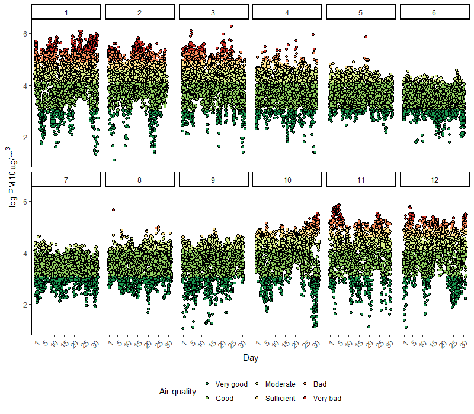

In my opinion we can obtain better results if we exclude summer months from the analysis. Of course in the summer we have higher temperatures, but other predictors won't vary as much in comparison to winter months. Also as there is no smog in summer, nobody will be interested in the model results for these months. Just for ensure we need to check the distribution of PM10 logarithm  after summer exclusion. As we can see below it's moved into right now, but still pretty close to normal.

Finally let's take a look at the differences in PM10 logarithm data during the day and on weekdays. In the picture below, boxplots are shown for each weekday. Also median value is presented as white line and value. We can see that Sunday 's smog is clearly lower than smog on the other days. I'm little surprised that Saturday's smog is on so high level.

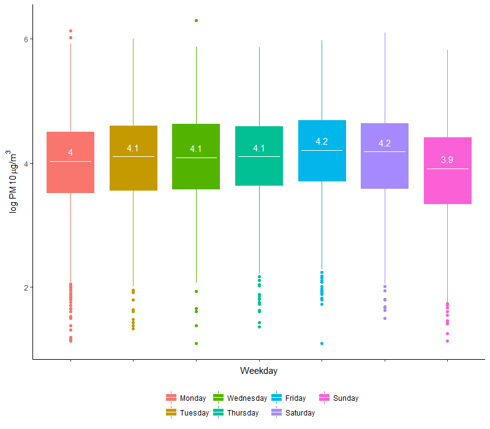

Finally, the distribution of PM10 logarithm over day hours. The blue line is a smooth spline and we can read from it few things. In general, starting from midnight, smog is on the highest level - it's probably connected with lower temperatures during night and coal-heating. Around 4-5 AM we can see little decrease in smog, what is probably connected with furnaces expiration, as the oldest (and worst from air pollution point of view) ones have no automatic refill. Subsequently there is morning increase, probably connected with peak traffic, and then again decrease in smog as temperatures go up and traffic decrease. In the evening and night we can see constantly increase connected with evening peak traffic and coal-heating - in this way the cycle begins again. There is no visible gap between evening traffic peak and night heating, so evening traffic impact on smog remains in the sphere of guesses.

##### Summary

In conclusion, we made two assumptions for next chapters:
* we use PM10 logarithm instead of pure values
* from May to September data were excluded

#### Temperature

There is no surprise here. Negative correlation between temperature and smog is very clear. There is also no big difference between linear and smooth spline model - increase around 10 degrees is probably conencted with the lack of data, instead of real correlation. We can confirm it by plotting the same graph on full data.

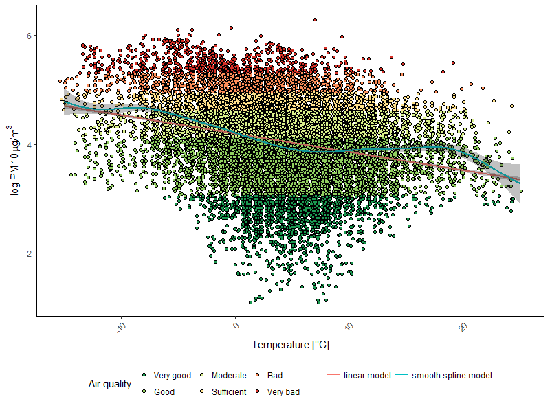

Our hypothesis regarding an anomaly of 10 degrees was correct, but there is something interesting for high temperatures! Again we can think that it's conneted with lack of data, but result is enormous. In my opinion spline model can be correct - during sweltering weather, everything is so dry that the dust is floating in the air. 

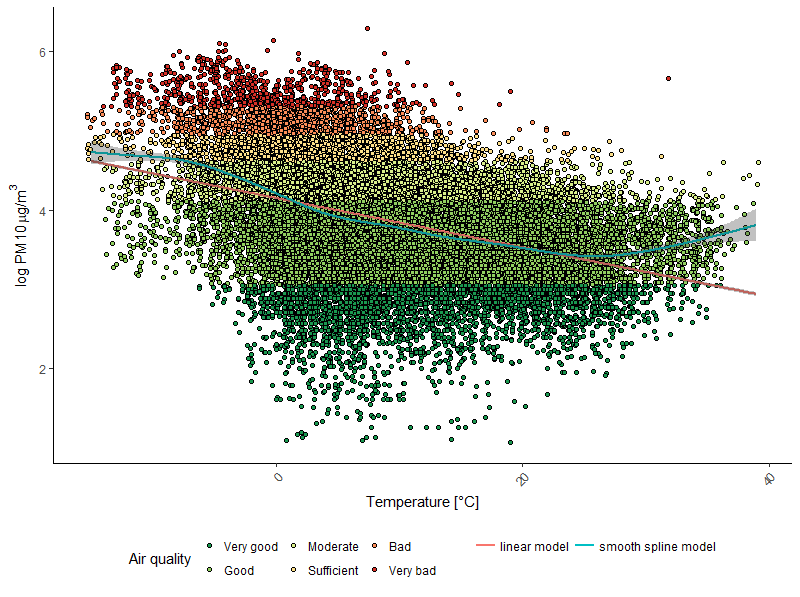

#### Wind speed

Here we've got exactly the same conclusion as for temperature - correlation is negative and obvious, also there is no difference in linear and smooth model if only amount of data is enough.

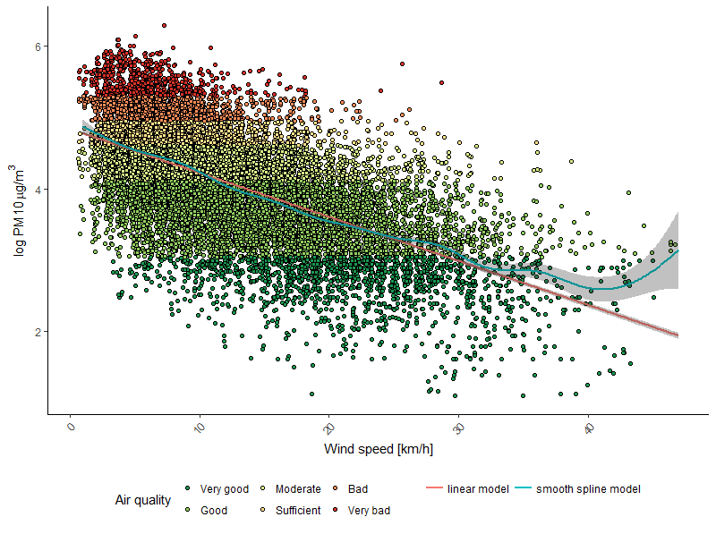

#### Humidity

There is almost no correlation beetwen humidity and smog for values greater than 40%. But for lower values smog seems to growth fast. So, is there any other factor that can be corelated only with low humidity? I think about freezing weather - it typically occurs together with sun and dry air.

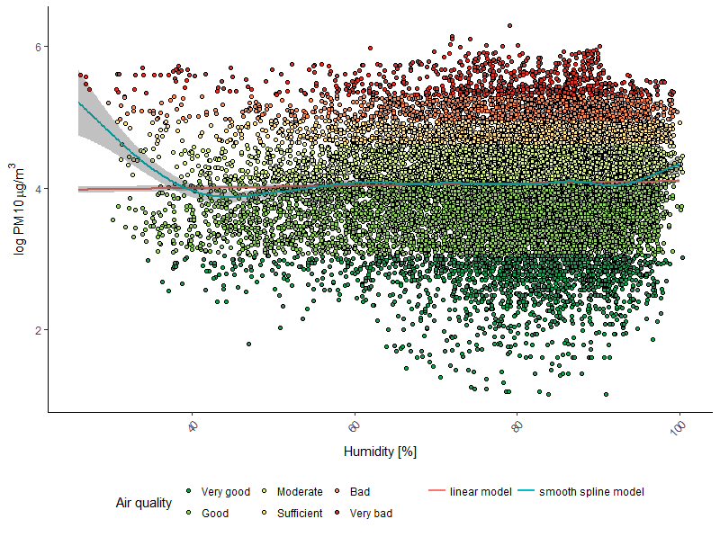

On the picture below we can see the correlation between temperature and humidity. Again for values below 40% there is a change in the trend, but I'm not sure if we have enough data for such a conclusion. In general, I would said that humidity has no impact on smog, but it's correlated with temperature in some areas, which has clearly impact on air pollution.

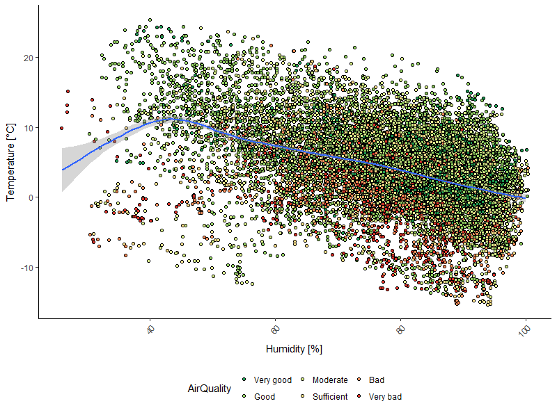

#### Pressure

Like for the wind speed and the temperature, correlation between the pressure and the smog is clear, but in this case it's positive. There is no big difference between smooth spline and linear model for middle data again, but for extreme values spline tends to overfitting.

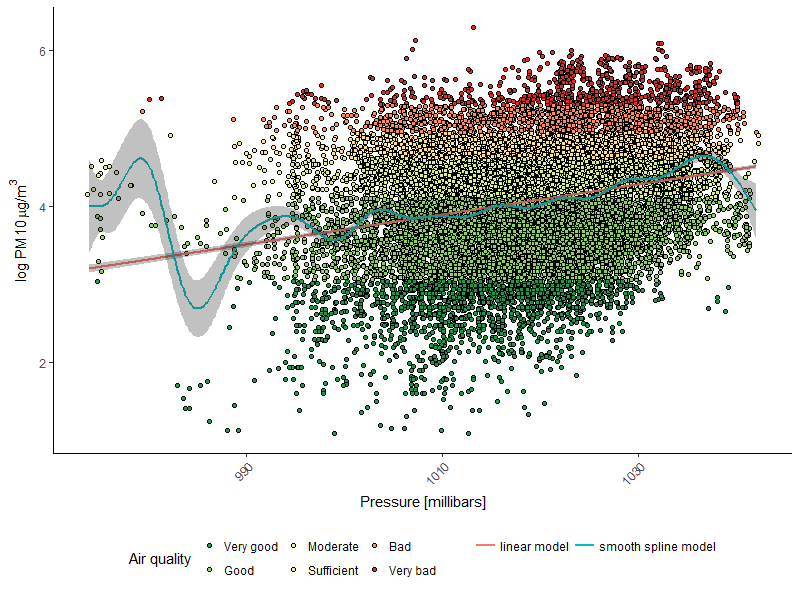

#### Precipitation

We can see that blue line is almost horizontal - there is increase only for very small values. Probably linear model is also biased by that low values. I would even say that that impact is coming from zero value i.e. no precipitation, and for the rest values the amount of precipitation has no impact on smog. We can examine it by creating new binary variable 'IfPrecipitation' that has two values: one for precipitation greater than zero and other otherwise. Finally I would plot models again only for values greater than zero.

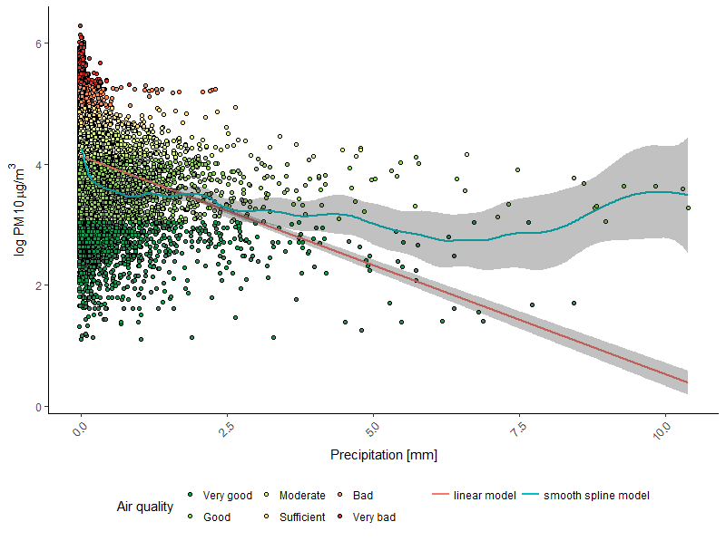

Indeed, on the picture below we can see that smog is lower if there are any precipitation. So we could include that new variable in future modelling.

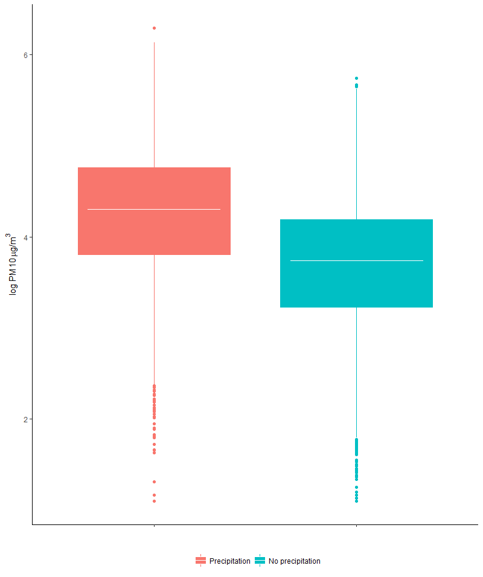

X axis is additionally modified by taking logarithmic scale. Lines form both models are mostly horizontal, only for extreme precipitations we can see some variability, but there is no enough data for any conclusion.

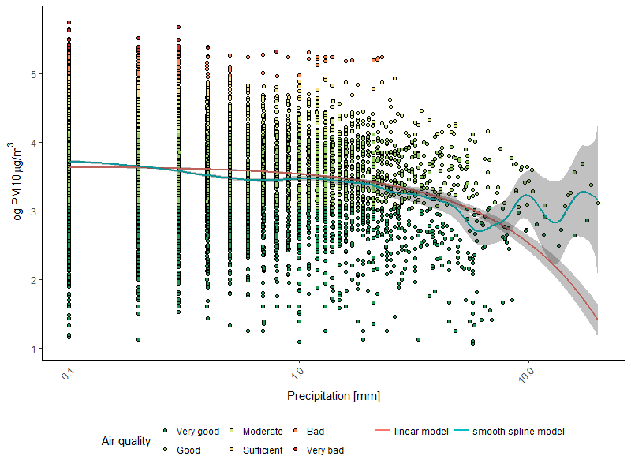

#### Feels like temperature

We know that picture from temperature plot. The only difference is that for extreme low temperatures smooth model goes below linear. As we know that feels like temperature is a product of temperature, wind speed and humidity, from previous plots we can assume that the aforementioned difference is due to increase in wind speed. So there is nothing new here and the impact from this variable is described by predictors mentioned before.

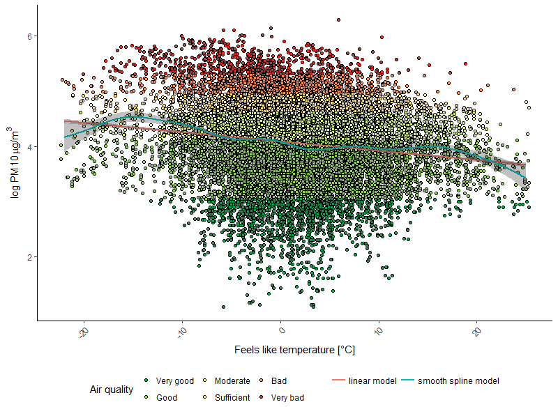

#### Cloudiness

Again both models are almost identical, but it's not difficult to notice that there is some correlation. For me, it's a completely unintuitive observation that the correlation is negative. 

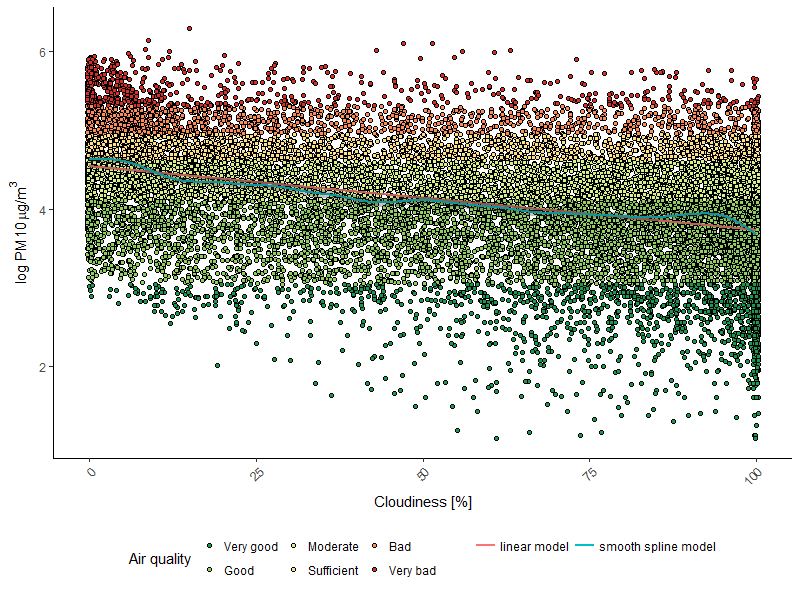

#### Wind direction

It's not correct to use linear model in cyclical data, so we would focus only on the smooth model. Also we should remember that wind direction is very specific predictor for chosen location that can't be generalized in any way. What we can said for Cracow? The smog is lower when wind blows from north-west direction. But let's check if that results is coming truely from direction, not from wind speed.

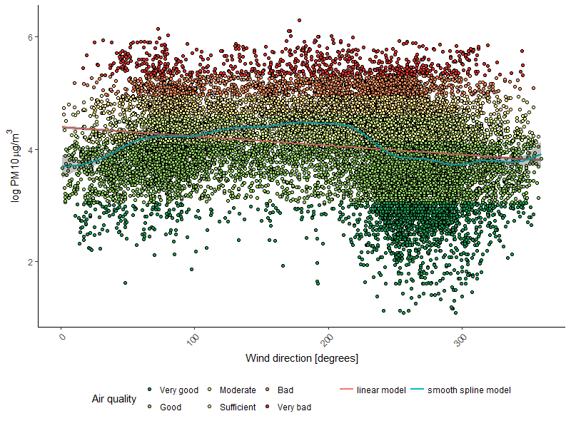

According to my supposition north-west winds are the strongest, and the blue line below is almost inverse of blue line in the previous picture. So in conclusion the wind direction has almost no impact on smog.

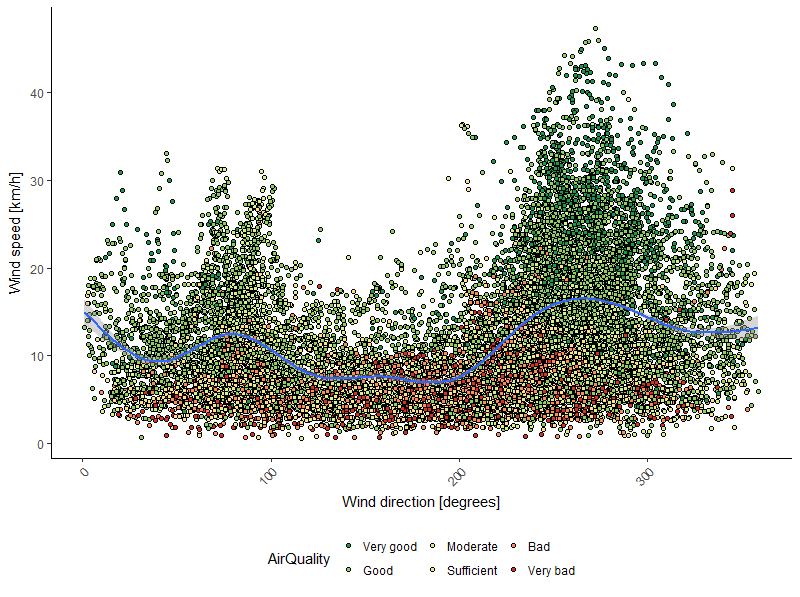

## PM10 modelling

## Air pollution modelling

