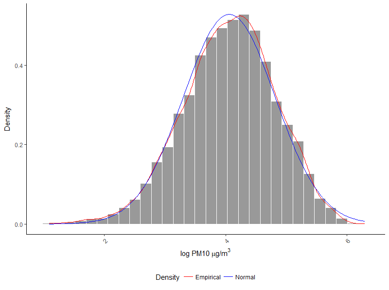

# Can we predict the smog only on the basis of the weather forecast?

## Table of context

* [Introduction](#introduction)  
* [Data sources](#data-sources)  
* [Data exploration](#data-exploration)  
  * [PM 10 distribution](#pm-10-distribution)  
  * [Temperature](#temperature)  
  * [Wind speed](#wind-speed)  
  * [Humidity](#humidity)  
  * [Pressure](#pressure)  
  * [Precipitation](#precipitation)  
  * [Feels like temperature](#feels-like-temperature)  
  * [Cloudiness](#cloudiness)  
  * [Wind direction](#wind-direction)  
* [PM10 modelling](#pm10-modelling)  
* [Air pollution modelling](#air-pollution-modelling)  
* [What's next?](#whats-next)  

## Introduction

Smog is a very big problem in Poland. Especially in a winter there are warnings in a mass media almost every day. The air here is one of the worst in Europe. There are mainly two things responsible for this state: transport and coal-heating. A lot of people argue about which of these sources has bigger impact on air pollution, but this is not the subject of this analysis. One the other hand there are some factors that decrease air pollution. For example it is well-known fact that strong wind blows away smog from the city. In this analysis I will try to find some predictors for smog levels. As I have full weather data and no data about traffic or coal-heating, I will make some assumptions. Temperature is probably highly correlated with heating usage, so I will assume that, it's a good substitution. There is a bigger problem with traffic, but I will take a closer look at smog level in rush hours and days of week.
Finally I want to answer the title question: as we can predict weather, can we also predict smog? Only on the basis of weather forecast. Probably accuracy of obtained model won't be the best (as if it was so simple everyone would do it), but maybe somebody could find it useful.

## Data sources

Analysis was performed on the basis on smog data (measured as PM10 concentration) and historical weather data in the period from January 1, 2015 to March 15, 2018. Smog data are powered by <a href="http://powietrze.gios.gov.pl" title="Chief Inspectorate For Environmental Protection"> Polish Chief Inspectorate For Environmental Protection</a>. 
Weather data are powered by <a href="https://developer.worldweatheronline.com/" title="Free Weather API" target="_blank">World Weather Online</a>. All data were available in 1-hour intervals.
Whole analysis was performed for one measured station located in Krasiński Street, Cracow, Poland. I believe that general ideas from this analysis could be applied into other locations, but detailed results may vary.
Available weather data included:
* Temperature (&deg;C)
* Wind speed (kmph)
* Humidity (%)
* Pressure (milibars)
* Precipitation (mm)
* Feels like temperature (&deg;C)
* Cloudiness (%)
* Wind direction (degrees)

## Data exploration

#### PM 10 distribution

For a start let's plot histogram for PM10. As we know PM10 can obtain any value greater than zero and as we can see in the picture below, distribution is skeewed in comparison to normal distribution with the same mean and standard deviation.

As it is easier to work with normal distribution, we can logarithm the data and, as a result obtain almost perfect normal distribution. So, from now we will focus only on PM10  logarithm data.

Next let's see PM10 logarithm over months. As it's hard to think about PM10 logarithm exact values I've painted data according to the Polish air pollution norms. We can clearly see that smog is a problem only in cold months - from October to April. 

In my opinion we can obtain better results if we exclude summer months from the analysis. Of course in the summer we have higher temperatures, but other predictors won't vary as much in comparison to winter months. Also as there is no smog in summer, nobody will be interested in the model results for these months. Just for ensure we need to check the distribution of PM10 logarithm  after summer exclusion. As we can see below it's moved into right now, but still pretty close to normal.

Finally let's take a look at the differences in PM10 logarithm data during the day and on weekdays. In the picture below, boxplots are shown for each weekday. Also median value is marked as white line and values are displayed. We can see that Sunday 's smog is clearly lower than other days. I'm little surprised that Saturday's smog is not in lower boundary, but is in one of the highest levels.

Last one is distribution of PM10 logarithm over hours. The blue line is a smooth spline and we can read from it few things. First smog is increasing durning night - it's connected to lower temperatures durning nigth and coal-heating. Around 4-5 AM we can see little decrease in smog, what is probably connected to furnaces expiration, as the oldest (and worst due to air pollution) ones have no automatic refill. Next is morning increase, probably connected to peak traffic, then again decrease and last increase in the evening connected with evening peak traffic. There is no visible gap between evening peak and night heating, so evening traffic impact on smog remains in the sphere of guesses.

###### Summary

In conclusion, we made two assumptions for next chapters:
* we use PM10 logarithm instead of pure values
* from May to September data were excluded

#### Temperature

#### Wind speed

#### Humidity

#### Pressure

#### Precipitation

#### Feels like temperature

#### Cloudiness

#### Wind direction

## PM10 modelling

## Air pollution modelling

## What's next?

- [x] Download data  
- [ ] Data exploration  
- [ ] PM10 gam modelling  
- [ ] Air pollution level gam modelling  
- [ ] More advanced modelling (random forest?)  

